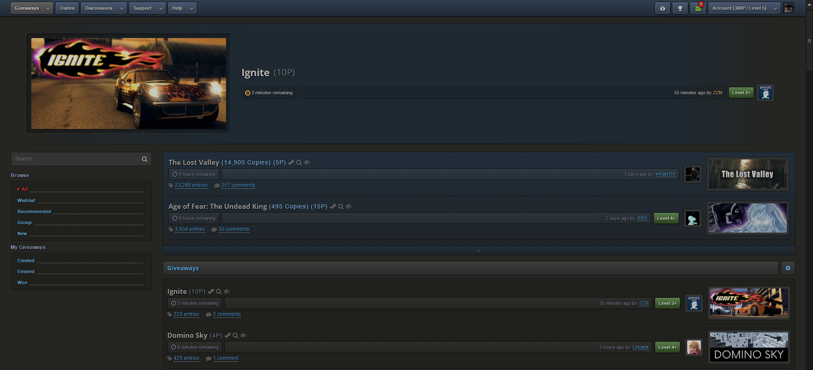

# SG-Dark-Grey

Dark Grey style for [steamgifts.com](https://www.steamgifts.com), [steamtrades.com](https://www.steamtrades.com), [sgtools.info](https://www.sgtools.info). Compatible with most scripts found in the [addon registry](https://www.steamgifts.com/discussion/Zevqn/)

---
 
## Current Version 2.2.5

## Preview

## Installation

Install [Stylus](https://add0n.com/stylus.html) for either [Firefox](https://addons.mozilla.org/en-US/firefox/addon/styl-us/), [Chrome](https://chrome.google.com/webstore/detail/stylus/clngdbkpkpeebahjckkjfobafhncgmne) or [Opera](https://addons.opera.com/en-gb/extensions/details/stylus/) and then install the style using one of these methods:

📦 [Install the usercss](https://github.com/SquishedPotatoe/SG-Dark-Grey/raw/master/SG-Dark-Grey.user.css) which supports automatic updates and customization. 
📦 [Install manually from GitHub](https://github.com/SquishedPotatoe/SG-Dark-Grey/raw/master/SG-Dark-Grey.css) with no customization. The style is in Mozilla format. 
📦 [Install script](https://github.com/SquishedPotatoe/SG-Dark-Grey/raw/master/SG-Dark-Grey.user.js)  which supports automatic updates but no customization. 

